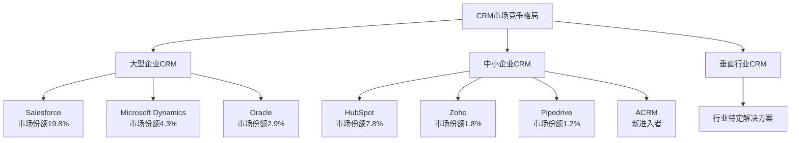

# 📊 ACRM项目商业分析报告

## 🎯 项目概况

### 项目定位
**面向中小企业销售团队的海外CRM解决方案**

- **目标用户**: 5-50人的中小企业销售团队
- **核心痛点**: 客户信息分散、跟进不及时、资源盘点困难
- **解决方案**: 集成化客户管理、智能提醒、数据可视化分析

## 📈 市场机会分析

### 全球CRM市场规模
- **2023年市场规模**: 637亿美元
- **预期增长率**: 年复合增长率13.9% (2023-2030)
- **2030年预期规模**: 1,454亿美元
- **主要增长驱动**: 数字化转型、远程办公、B2B销售增长

### 细分市场机会
| 细分领域 | 市场规模 | 增长率 | 机会评估 |
|----------|----------|--------|----------|
| 中小企业CRM | 120亿美元 | 16.2% | ⭐⭐⭐⭐⭐ |
| 海外贸易CRM | 15亿美元 | 18.5% | ⭐⭐⭐⭐⭐ |
| SaaS化CRM | 89亿美元 | 19.1% | ⭐⭐⭐⭐ |
| 移动端CRM | 23亿美元 | 22.3% | ⭐⭐⭐⭐ |

### 目标地区分析
**主要目标市场:**

1. **东南亚** (第一优先级)
   - 市场规模: 12亿美元
   - 年增长率: 25%+
   - 优势: 数字化进程快，中小企业多
   - 挑战: 本地化需求，竞争激烈

2. **中东地区** (第二优先级)
   - 市场规模: 8亿美元
   - 年增长率: 20%
   - 优势: 支付能力强，英语普及
   - 挑战: 文化差异，法规复杂

3. **南美市场** (第三优先级)
   - 市场规模: 6亿美元
   - 年增长率: 18%
   - 优势: 价格敏感度适中
   - 挑战: 语言本地化需求

## 🏆 竞品分析

### 竞争格局矩阵



### 主要竞品详细分析

#### 1. HubSpot CRM
**优势:**
- 免费版本吸引用户
- 界面友好，易于上手
- 营销自动化集成
- 生态系统完善

**劣势:**
- 高级功能价格昂贵 ($800+/月)
- 主要针对欧美市场
- 海外访问速度较慢
- 中文本地化不足

**市场份额:** 7.8%
**年收入:** 18.4亿美元

#### 2. Pipedrive
**优势:**
- 流程管理直观
- 价格相对合理
- 移动端体验好
- 易于定制

**劣势:**
- 报表功能较弱
- 客户服务响应慢
- 集成能力有限
- 大企业功能不足

**市场份额:** 1.2%
**年收入:** 1.2亿美元

#### 3. Zoho CRM
**优势:**
- 价格竞争力强
- 功能模块丰富
- 支持多语言
- 定制性强

**劣势:**
- 界面设计陈旧
- 学习曲线陡峭
- 性能不够稳定
- 品牌知名度较低

**市场份额:** 1.8%
**年收入:** 1.8亿美元

### ACRM的竞争优势

| 维度 | ACRM | HubSpot | Pipedrive | Zoho |
|------|------|---------|-----------|------|
| **价格竞争力** | ⭐⭐⭐⭐⭐ | ⭐⭐ | ⭐⭐⭐ | ⭐⭐⭐⭐ |
| **界面友好度** | ⭐⭐⭐⭐⭐ | ⭐⭐⭐⭐⭐ | ⭐⭐⭐⭐ | ⭐⭐ |
| **本地化程度** | ⭐⭐⭐⭐⭐ | ⭐⭐ | ⭐⭐⭐ | ⭐⭐⭐ |
| **客户关系网络** | ⭐⭐⭐⭐⭐ | ⭐⭐ | ⭐⭐ | ⭐⭐⭐ |
| **部署速度** | ⭐⭐⭐⭐⭐ | ⭐⭐⭐ | ⭐⭐⭐⭐ | ⭐⭐ |

## 💰 商业模式设计

### 收入模式

#### 1. 订阅收费模式 (主要收入)
```
基础版: $8/用户/月
├── 客户管理 (500个客户)
├── 基础联系记录
├── 简单报表
└── 邮件支持

专业版: $18/用户/月  
├── 无限客户数量
├── 高级报表分析
├── 关系网络图谱
├── 团队协作功能
├── API接入 (基础)
└── 优先技术支持

企业版: $30/用户/月
├── 专业版所有功能
├── 高级API接入
├── 自定义字段无限
├── 数据导出无限
├── 专属客户经理
└── SLA保证
```

#### 2. 增值服务 (补充收入)
- **数据迁移服务**: $200-$500/次
- **定制开发**: $1000-$5000/项目
- **培训服务**: $100/小时
- **第三方集成**: $500-$2000/集成

#### 3. 合作伙伴佣金 (长期收入)
- **代理商模式**: 30-40%分成
- **集成伙伴**: 单次$100-500佣金
- **推荐奖励**: 首年收入20%

### 定价策略分析

#### 竞品定价对比
| 产品 | 基础版 | 专业版 | 企业版 |
|------|--------|--------|--------|
| **HubSpot** | 免费 | $800/月 | $3200/月 |
| **Pipedrive** | $15/用户 | $29/用户 | $99/用户 |
| **Zoho** | $12/用户 | $20/用户 | $45/用户 |
| **ACRM** | $8/用户 | $18/用户 | $30/用户 |

**定价优势:**
- 比Pipedrive便宜47%
- 比Zoho便宜33%
- 企业版比主流产品便宜60-90%

## 📊 财务预测

### 5年财务规划

#### 年度用户增长预测
```
Year 1: 500用户 (MVP上线)
Year 2: 2,500用户 (功能完善)
Year 3: 8,000用户 (市场扩张)
Year 4: 20,000用户 (品牌建立)
Year 5: 45,000用户 (行业领先)
```

#### 收入预测 (美元)
| 年份 | 订阅收入 | 增值服务 | 总收入 | 增长率 |
|------|----------|----------|--------|--------|
| Year 1 | $65,000 | $15,000 | $80,000 | - |
| Year 2 | $420,000 | $80,000 | $500,000 | 525% |
| Year 3 | $1,680,000 | $220,000 | $1,900,000 | 280% |
| Year 4 | $4,200,000 | $450,000 | $4,650,000 | 145% |
| Year 5 | $9,450,000 | $800,000 | $10,250,000 | 120% |

#### 成本结构预测
| 成本项 | Year 1 | Year 2 | Year 3 | Year 4 | Year 5 |
|--------|--------|--------|--------|--------|--------|
| **技术开发** | $45,000 | $180,000 | $380,000 | $650,000 | $1,100,000 |
| **市场营销** | $25,000 | $125,000 | $380,000 | $930,000 | $2,050,000 |
| **运营成本** | $15,000 | $75,000 | $190,000 | $465,000 | $1,025,000 |
| **总成本** | $85,000 | $380,000 | $950,000 | $2,045,000 | $4,175,000 |

#### 利润预测
```
Year 1: -$5,000 (投入期)
Year 2: $120,000 (24%利润率)
Year 3: $950,000 (50%利润率)
Year 4: $2,605,000 (56%利润率)
Year 5: $6,075,000 (59%利润率)
```

## 🚀 市场进入策略

### Phase 1: MVP验证 (0-6个月)
**目标:** 产品验证，获得前100个付费用户

**策略:**
- 专注核心功能开发
- 寻找种子用户试用
- 收集用户反馈迭代
- 建立基础品牌认知

**投入:** $50,000
**预期回报:** 初步市场验证

### Phase 2: 市场扩张 (6-18个月)
**目标:** 扩大用户基础，达到2,500用户

**策略:**
- 内容营销建立权威
- SEO优化提升搜索排名
- 社交媒体推广
- 合作伙伴开发

**投入:** $250,000
**预期回报:** 建立市场地位

### Phase 3: 规模化增长 (18-36个月)
**目标:** 成为细分市场领导者

**策略:**
- 大规模数字营销
- 国际市场拓展
- 产品功能深化
- 生态系统建设

**投入:** $800,000
**预期回报:** 行业领导地位

## ⚡ 风险分析与应对

### 主要风险因素

#### 1. 技术风险 (概率: 中, 影响: 高)
**风险:** 技术架构不稳定，性能问题
**应对策略:**
- 选择成熟技术栈
- 建立完善测试体系
- 云服务确保可扩展性
- 备份与容灾机制

#### 2. 市场竞争风险 (概率: 高, 影响: 中)
**风险:** 大厂降价竞争，新进入者
**应对策略:**
- 专注细分市场差异化
- 快速迭代响应市场需求
- 建立用户粘性
- 成本控制保持价格优势

#### 3. 资金风险 (概率: 中, 影响: 高)
**风险:** 资金链断裂，无法持续运营
**应对策略:**
- 分阶段融资降低风险
- 快速实现正向现金流
- 多元化收入来源
- 成本精细化管理

#### 4. 政策法规风险 (概率: 低, 影响: 高)
**风险:** 数据保护法规变化
**应对策略:**
- 严格遵守GDPR等法规
- 数据本地化存储
- 定期法规合规审查
- 法务团队建设

## 📋 实施建议

### 立即行动清单

#### 技术准备 (1-2个月)
- [x] 完善技术架构设计
- [x] 搭建开发环境
- [ ] 完成MVP功能开发
- [ ] 部署测试环境
- [ ] 建立CI/CD流程

#### 市场准备 (并行进行)
- [ ] 注册商标和域名
- [ ] 设计品牌视觉识别
- [ ] 建立官方网站
- [ ] 准备营销材料
- [ ] 寻找种子用户

#### 团队建设
- [ ] 招聘前端开发工程师
- [ ] 招聘后端开发工程师
- [ ] 招聘UI/UX设计师
- [ ] 招聘市场营销专员
- [ ] 建立远程协作机制

#### 资金规划
- [ ] 制定详细预算计划
- [ ] 寻找天使投资人
- [ ] 申请政府创业资助
- [ ] 建立财务管理体系

### 成功关键因素

1. **产品体验**: 简单易用，响应速度快
2. **客户服务**: 快速响应，专业支持
3. **本地化**: 语言、文化、支付方式
4. **成本控制**: 精细化运营，提高效率
5. **团队建设**: 招聘优秀人才，保持团队稳定

## 🎯 结论与建议

### 项目可行性评估: ⭐⭐⭐⭐⭐

**优势:**
- 市场需求明确且增长快速
- 竞争对手定价偏高，存在机会窗口
- 技术实现难度适中
- 商业模式清晰可行

**建议:**
1. **立即启动MVP开发**，6个月内上线
2. **专注中小企业市场**，避免与大厂正面竞争
3. **优先东南亚市场**，建立根据地
4. **快速迭代**，根据用户反馈调整产品
5. **建立合作伙伴网络**，加速市场渗透

**预期结果:**
如果执行得当，3年内可以达到年收入1000万美元，成为细分市场的重要参与者。

---

*本报告基于2024年初市场数据分析，建议定期更新以保持准确性。* 